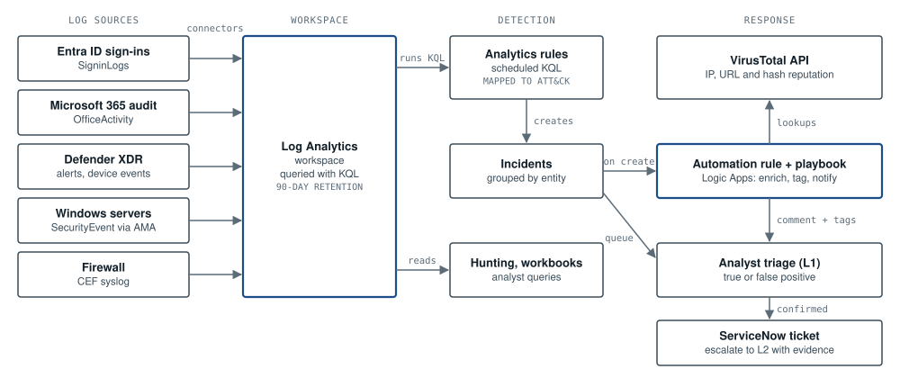

# Sentinel SOC automation

Detection rules, hunting queries and response playbooks for a Microsoft Sentinel SOC. The data sources are Entra ID sign-ins, Microsoft 365 audit logs and Defender for Endpoint.

Part of my portfolio: [archirose.github.io](https://archirose.github.io) (designs SOC-01 to SOC-04 and SOC-06). The architecture behind it is written up in [security-designs / ARC-01](https://github.com/ArchiRose/security-designs/blob/main/designs/arc-01-sentinel-soc-architecture.md).

## Analytics rules

Each rule comes as a `.kql` file you can read quickly and a `.yaml` file in the Microsoft Sentinel community rule format. The YAML adds schedule, severity, MITRE mapping and entity mapping.

| Rule | MITRE ATT&CK | Severity | Data |
|---|---|---|---|
| [Failed sign-ins followed by a success from the same IP](analytics-rules/brute-force-then-success.kql) | T1110, T1078 | High | `SigninLogs` |
| [New inbox rule that forwards or redirects mail](analytics-rules/inbox-forwarding-rule.kql) | T1114.003, T1564.008 | Medium | `OfficeActivity` |
| [PowerShell started with an encoded command](analytics-rules/encoded-powershell.kql) | T1059.001 | Medium | `DeviceProcessEvents` |
| [Shadow copies or backup catalogue deleted](analytics-rules/shadow-copy-deletion.kql) | T1490 | High | `DeviceProcessEvents` |

Every rule maps its account, IP and host entities, so related alerts group into one incident and playbooks can act on them. Thresholds sit in `let` statements at the top of each query, so tuning takes one line.

## Hunting queries

| Query | Used for |
|---|---|
| [phishing-recipients.kql](hunting-queries/phishing-recipients.kql) | Phishing triage (SOC-03): who else got the reported email, and which links it carried |
| [open-incidents-handover.kql](hunting-queries/open-incidents-handover.kql) | Shift handover (SOC-06): open incidents by severity, owner and age |
| [new-mfa-method-registered.kql](hunting-queries/new-mfa-method-registered.kql) | Mailbox takeover persistence: new MFA methods (attack chain ATK-01, step 4) |

## Playbooks

| Playbook | What it does |
|---|---|
| [incident-enrichment.azuredeploy.json](playbooks/incident-enrichment.azuredeploy.json) | Logic App. When an incident opens, it looks up every IP in VirusTotal, comments a summary table on the incident and tags it. The API key is read from Key Vault, and the playbook never changes incident status |
| [Invoke-AccountContainment.ps1](playbooks/Invoke-AccountContainment.ps1) | After analyst approval, revokes sessions, blocks sign-in and removes forwarding inbox rules. Refuses admin and protected accounts, and logs who approved each action |

Deployment steps and permissions are in [playbooks/README.md](playbooks/README.md).

## Using the rules

- **Quickest:** in Sentinel, go to **Analytics → Create → Scheduled query rule**. Paste the `.kql`, then copy the schedule, entity mapping and MITRE tactics from the matching `.yaml`.
- **As code:** the YAML follows the format used in the [Azure-Sentinel community repository](https://github.com/Azure/Azure-Sentinel/tree/master/Detections). Convert it to an ARM template for Sentinel Repositories or your own pipeline.

Run each query in **Logs** against a week of your own data before enabling it, and tune the thresholds to your baseline.

## Testing status

The queries are written against the standard Sentinel and Defender table schemas, and the ARM template is valid JSON. Nothing here has been run from this repository against a live workspace or tenant. Treat everything as a starting point: test it in a lab workspace, check the results against known activity, then enable it.

## Licence

MIT
